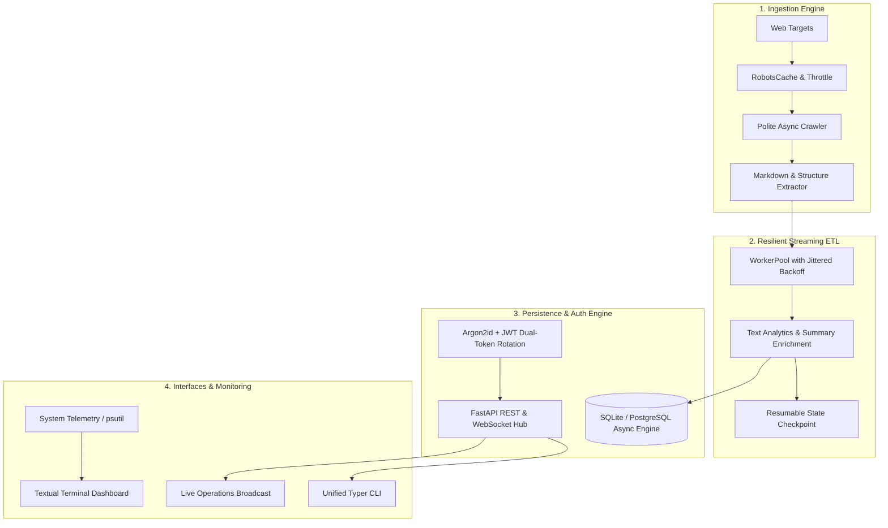

# Nexus ⚡

**Autonomous Web Ingestion, Streaming ETL, REST/WebSocket API & Realtime Operations Monitor**

[](https://github.com/Chetan0246/nexus/actions/workflows/ci.yml)
[](https://www.python.org/)
[](LICENSE)
[](https://github.com/astral-sh/ruff)

Nexus unites web crawling, streaming ETL transformations, an asynchronous REST/WebSocket service, and a terminal operations dashboard into a unified, high-performance data intelligence platform.

---

## 🏛 Architecture



---

## 🚀 Key Features

- **Autonomous Polite Crawler**: Respects `robots.txt` crawl-delay, enforces per-host concurrency, skips non-HTML binaries, and converts HTML into clean Markdown.
- **Resilient Streaming ETL**: Bounded async worker pool, exponential backoff with full jitter, text analytics (word count, reading time, summary), and deterministic `.checkpoint.json` crash recovery.
- **Production REST & WebSocket API**: FastAPI application featuring Argon2id password hashing, JWT access/refresh rotation, Redis-compatible sliding-window rate limiting, and pub/sub room broadcasting.
- **Terminal Operations Dashboard**: Full-screen Textual TUI with live sparklines, gauge meters, searchable log streaming, and dynamic log level filtering.
- **Unified Typer CLI**: Single binary command `nexus` for running crawlers, ETL pipelines, starting API servers, launching TUI monitors, and executing end-to-end autonomous ingestion.

---

## 📦 Quick Start

### 1. Installation

```bash
# Clone the repository
git clone https://github.com/Chetan0246/nexus.git
cd nexus

# Install with development dependencies
pip install -e ".[dev]"
```

### 2. Verify CLI

```bash
nexus --help
nexus version
```

---

## 🛠 Command-Line Interface (CLI)

The `nexus` CLI provides five core subcommands:

### 1. Autonomous Web Crawler
```bash
# Crawl target domain politely, saving Markdown & metadata to JSONL
nexus crawl https://example.com --max-pages 25 --max-depth 2 --output data/crawled.jsonl
```

### 2. Streaming ETL Pipeline
```bash
# Process, analyze, and enrich raw data with checkpoint resume enabled
nexus pipeline data/crawled.jsonl data/enriched.jsonl --workers 8 --resume
```

### 3. REST & WebSocket API Server
```bash
# Launch FastAPI server on localhost:8000
nexus serve --host 127.0.0.1 --port 8000 --reload
```
- Interactive Swagger UI: `http://localhost:8000/swagger`
- Health Telemetry: `http://localhost:8000/health`
- WebSocket Stream: `ws://localhost:8000/ws/operations`

### 4. Real-time Operations Dashboard
```bash
# Launch full-screen interactive Textual terminal dashboard
nexus monitor --interval 0.5
```
*Keyboard Shortcuts in Dashboard:*
- `p`: Pause / resume live metric updates
- `f`: Cycle log filters (`ALL`, `DEBUG`, `INFO`, `WARN`, `ERROR`)
- `c`: Clear log window
- `q`: Quit dashboard

### 5. End-to-End Ingest
```bash
# Crawl -> Transform -> Database Persistence in one atomic command
nexus ingest https://example.com --max-pages 10 --output data/backup.jsonl
```

---

## 🔐 REST API Endpoints

| Method | Endpoint | Description | Auth Required |
|:-------|:---------|:------------|:--------------|
| `POST` | `/auth/register` | Register user account | No |
| `POST` | `/auth/login` | Authenticate and obtain JWT pair | No |
| `POST` | `/auth/refresh` | Rotate access token via refresh token | No |
| `POST` | `/auth/logout` | Revoke active refresh token | Yes |
| `GET` | `/auth/me` | Fetch authenticated user profile | Yes |
| `POST` | `/docs` | Upsert crawled document record | Yes |
| `GET` | `/docs` | List paginated documents with text search | No |
| `GET` | `/docs/{id}` | Retrieve document by ID | No |
| `DELETE`| `/docs/{id}` | Delete document | Yes (Admin/Owner) |
| `GET` | `/health` | System uptime & WebSocket hub stats | No |
| `WS` | `/ws/{room}` | Connect to live operational broadcast | Optional |

---

## 🧪 Testing & Quality Assurance

```bash
# Run strict Ruff linter and import checker
ruff check .

# Run asynchronous test suite with coverage
pytest -q
```

---

## 📄 License

This project is licensed under the MIT License.
